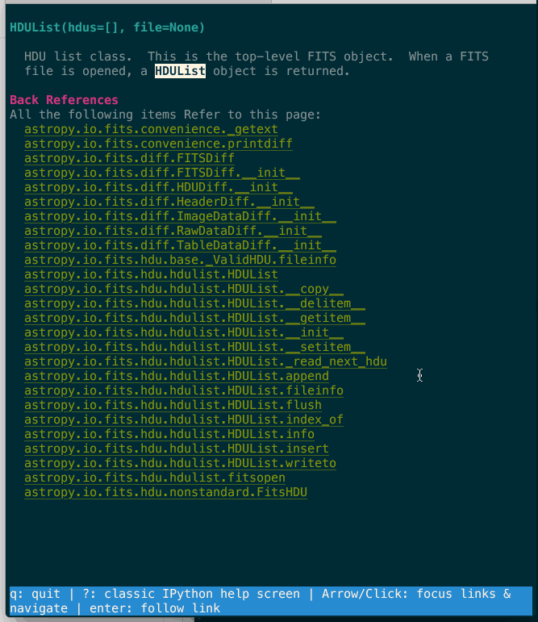
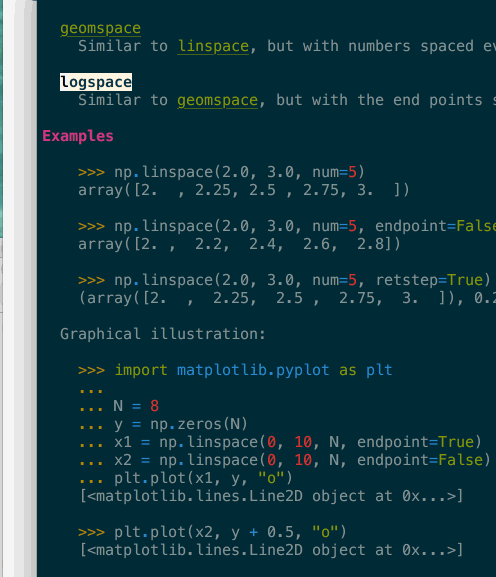
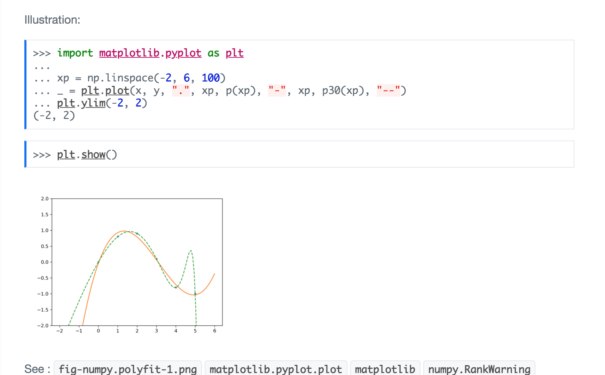
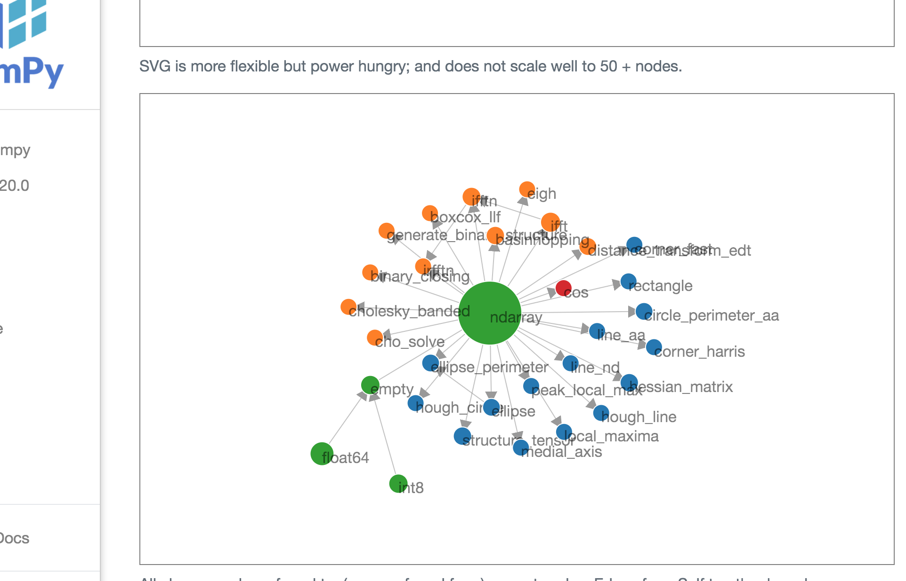
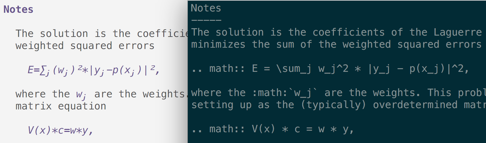

# Papyri

**Papyri** is a set of tools to build, publish (future functionality - to be done), install and render
documentation within IPython and Jupyter.

---

> **Project status (2026): revival in progress.** The last upstream release was
> `0.0.8` (March 2024). The core `gen` / `ingest` / `render --html` pipeline
> still works on Python 3.11, but only with a `tree-sitter` pin — see
> [Installation](#installation). Several commands (`rich`, `install`) are
> currently broken or point at unmaintained infrastructure. The published
> documentation bundles at `https://pydocs.github.io/pkg` are no longer
> guaranteed to exist or be compatible with the current schema. See
> [Known breakage](#known-breakage) before filing issues.

| Information | Links |
| :---------- | :-----|
|   Project   | [](https://opensource.org/license/mit/) |
|     CI      | [](https://github.com/carreau/papyri/actions/workflows/python-package.yml) [](https://github.com/carreau/papyri/actions/workflows/lint.yml) |

Papyri aims to allow:
- bidirectional crosslinking across libraries,
- navigation,
- proper reflow of user docstrings text,
- proper reflow of inline images (when rendered to html),
- proper math rendering (both in terminal and html),
- and more.

## Motivation

See some of the reasons behind the project on [this blog post](https://labs.quansight.org/blog/2021/05/rethinking-jupyter-documentation/).

Key motivation is building a set of tools to build better documentation for Python projects.
  - Uses an opinionated implementation to enable better understanding about the structure of your project.
  - Allow automatic cross-links (back and forth) between documentation across Python packages.
  - Use a documentation IR (intermediate representation) to separate building the docs from rendering the docs in many contexts.

This approach should hopefully allow a conda-forge-like model, where projects upload their IR to a given repo, a _single
website_ that contains documentation for multiple projects (without sub domains). The documentation pages can then be built with better cross-links between
projects, and _efficient_ page rebuild.

This should also allow displaying user-facing documentation on _non html_ backends (think terminal), or provide documentation in an
IDE (Spyder/Jupyterlab), without having to iframe it.

## Overview Presentation

And this [small presentation at CZI EOSS4 meeting in early november 2021](https://docs.google.com/presentation/d/1sSh44smooCiOlj0-Zrac9n5KX0K_ABBFznDmMIwUnbM/edit?usp=sharing).

## Screenshots

<detail>
<summary>Click to expand</summary>
Navigating astropy's documentation from within IPython. Note that this includes
forward refs but also backward references (i.e. which pages link to the current page.)



Type inference and keyboard navigation in terminal: Directives are properly
rendered in terminal, examples are type inferred, clicking (or pressing enter)
on highlighted tokens would open said page (backspace navigates back).



Since Jupyter Notebook and Lab pages can render HTML, it should be possible to have
inline graphs and images when using Jupyter inline help (to be implemented). In
terminals, we replace inline images with a button/link to open images in an
external viewer (quicklook, evince, paint...)



Papyri has complete information about which pages link to other pages; this allows
us to create a local graph of which pages mention each other to find related topics.

Below, you can see the local connectivity graph for `numpy.zeros` (d3js, draggable, clickable).
`numpy.zeroes` links to (or is linked from) all dots present there. In green, we show other
numpy functions; in blue, we show skimage functions; in orange, we show scipy functions; in red, we show xarray functions. Arrows
between dots indicate pages which link to each other (for example ndarray is linked
from `xarray.cos`), and dot size represents the _popularity_ of a page.



Math expressions are properly rendered even in the terminal: here, `polyfit` is shown in IPyhton with
papyri enabled (left) and disabled (right).


</detail>

---

## Table of contents

- [Installation](#installation)
- [Known breakage](#known-breakage)
- [Usage](#usage)
- [Rendering](#rendering)
- [Architecture](#architecture)

## Installation

Papyri is `pyproject.toml`-driven and requires Python 3.11. Newer Python
versions are not yet tested; older ones are explicitly unsupported.

### Development installation (recommended)

The project has not been re-cut on PyPI in over a year and is evolving faster
than releases. Install from a clone:

```
git clone https://github.com/carreau/papyri
cd papyri
pip install -e .
# The tree_sitter_languages wheel we depend on is not compatible with
# tree-sitter >= 0.22. Pip will happily resolve to a newer tree-sitter
# and then crash at import time. Pin it:
pip install 'tree-sitter<0.22'
```

Verify with:

```
papyri --help
```

The `git submodule update --init && papyri build-parser` step described in
older instructions is no longer required for the default code path; the RST
grammar is consumed via the `tree_sitter_languages` wheel. The `build-parser`
subcommand is still available for development on the grammar itself.

### Installation from PyPI

`pip install papyri` will install `0.0.8` from March 2024. It installs, but we
don't recommend it for now — the bundled CLI and dependency pins are out of
sync with current upstream. Prefer the development install above.

### Pre-built documentation bundles

Historical bundles (numpy 1.20, scipy 1.5, xarray 0.17) were published at
`https://pydocs.github.io/pkg`. That host is not maintained and the bundles
predate several schema changes, so `papyri install <pkg>` is not expected to
work end-to-end today. Generate bundles locally instead (see [Usage](#usage)).

## Known breakage

Things currently known *not* to work as documented:

- `papyri install <pkg>` — depends on an unmaintained bundle host.
- `papyri rich <name>` — fails with `StopIteration` in `render.py` when
  looking up a qualified name, even after a successful `gen` + `ingest`.
- `papyri textual <name>` — experimental; shares the rich lookup path.
- `papyri serve` — Quart-based live server; untested in the current revival.
- Unit tests: most pass, but `test_take2.py` has a circular-import issue
  when collected individually, and `test_gen.py::test_numpy` is brittle
  against modern numpy where canonical module paths for built-ins have
  changed (e.g. `numpy:array`).

Things that *do* work end-to-end on a fresh Python 3.11 install (with the
`tree-sitter` pin above):

- `papyri gen examples/papyri.toml --no-infer`
- `papyri ingest ~/.papyri/data/papyri_<version>`
- `papyri render --html` (output under `~/.papyri/html`)
- `papyri serve-static`

If you hit a `SqlOperationalError`, the DB schema has probably changed —
`rm -rf ~/.papyri/ingest/` and re-ingest.

### Testing

Install extra development dependencies by running:

```bash
$ pip install -r requirements-dev.txt
```

Run tests using

```bash
$ python -m pytest -m "not postingest"
```

(Using `python -m pytest` ensures the test runner uses the same interpreter as
your editable install, avoiding `ModuleNotFoundError: tomli_w` if you have a
separate `pytest` on `$PATH`.)

The `postingest` tests require `papyri ingest` to have populated
`~/.papyri/ingest/` first; see the CI workflow for the full sequence.

## Usage

Papyri relies on three steps:

 - IR generation (executed by package maintainers);
 - IR installation (executed by end users or via pip/conda);
 - IR rendering (usually executed by the IDE, CLI/webserver).

### IR Generation (`papyri gen`)

This is the step you want to trigger if you are building documentation using Papyri for a library you maintain. Most
likely as an end user you will not have to issue this step and can install pre-published documentation bundles.
This step is likely to occur only once per new release of a project.

The Toml files in `examples` will give you example configurations from some existing libraries.

```
$ ls -1 examples/*.toml
examples/IPython.toml
examples/astropy.toml
examples/dask.toml
examples/matplotlib.toml
examples/numpy.toml
examples/papyri.toml
examples/scipy.toml
examples/skimage.toml
```

Right now these files lives in papyri but would likely be in relevant repositories under `docs/papyri.toml` later on.

> [!NOTE]
> It is _slow_ on full numpy/scipy; use `--no-infer` (see below) for a subpar but faster experience.

Use `papyri gen <path to example file>`

for example:

```
$ papyri gen examples/numpy.toml
```

```
$ papyri gen examples/scipy.toml
```

This will create intermediate docs files in in `~/.papyri/data/<library name>_<library_version>`. See [Generation](#generation-papyri-gen) for more details.

You can also generate intermediate docs files for a subset of objects using the `--only` flag. For example:

```
$ papyri gen examples/numpy.toml --only numpy:einsum
```

> [!IMPORTANT]
> To avoid ambiguity, papyri uses [fully qualified names](#qualified-names) to refer to objects. This means that you need to use `numpy:einsum` instead of `einsum` or `numpy.einsum` to refer to the `einsum` function in the `numpy` module, for example.


### Installation/ingestion

The installation/ingestion of documentation bundles is the step that makes all
bundles "aware" of each other, and allows crosslinking/indexing to work.

We'll reserve the term "install" and "installation" for when you download pre-build
documentation bundle from an external source and give only the package name
– which is not completely implemented yet.

You can ingest local folders with the following command:

```
$ papyri ingest ~/.papyri/data/<path to folder generated at previous step>
```

This will crosslink the newly generated folder with the existing ones.
Ingested data can be found in  `~/.papyri/ingest/` but you are not supposed to
interact with this folder with tools external to papyri.

There are currently a couple of pre-built documentation bundles that can be
pre-installed, but are likely to break with each new version of papyri. We
suggest you use the developer installation and ingestion procedure for now.

## Rendering

The last step of the papyri pipeline is to render the docs, or the subset that
is of interest to you. This will likely be done by your favorite IDE, probably
just in time when you explore documentation. Nonetheless, we've
implemented a couple of external renderers to help debug issues.

> [!WARNING]
> Many rendering methods currently require papyri's own docs to be built and ingested first.

```
$ papyri gen examples/papyri.toml
$ papyri ingest ~/.papyri/data/papyri_0.0.7  # or any current version
```

Or you can try to pre-install an old papyri doc bundle:

```
$ papyri install papyri
```

### Standalone HTML rendering

To see the rendered documentation for all packages previously ingested, run

```bash
$ papyri serve
```

This will start a live server that will render the pages on the fly.

If you need to render static versions of the pages, use either of the following
commands:

```bash
$ papyri render  # render all the html pages statically in ~/.papyri/html
$ papyri serve-static # start a http.server with the proper root to serve above files.
```

### Rich terminal rendering

To render the documentation for a single object on a terminal, use

```
$ papyri rich <fully qualified name>
```

For example:

```
$ papyri rich numpy:einsum  # note the colon for the fully qualified name.
```

To use the experimental interactive Textual interface in the terminal, use

```
$ papyri textual <fully qualified name>
```

### IPython extension

To run `papyri` as an IPython extension, run:

```
$ ipython --ext papyri.ipython
```

This will start an IPython session with an augmented `?` operator.

### Jupyter extension

In progress.

### More commands

You can run `papyri` without a command to see all currently available commands.

## Papyri - Name's meaning

See the legendary [Villa of Papyri](https://en.wikipedia.org/wiki/Villa_of_the_Papyri), which get its name from its
collection of many papyrus scrolls.

## Architecture

### Generation (`papyri gen`)

Collects the documentation of a project into a *DocBundle* -- a number of
*DocBlobs* (currently json files), with a defined semantic structure, and
some metadata (version of the project this documentation refers to, and
potentially some other blobs).

During the generation a number of normalisation and inference steps can and
should happen. For example:

  - Using type inference into the `Examples` sections of docstrings and storing
    those as pairs (token, reference), so that you can later decide that
    clicking on `np.array` in an example brings you to numpy array
    documentation; whether or not we are currently in the numpy documentation;
  - Parsing "See Also" into a well defined structure;
  - Running examples to generate images for docs with images (partially
    implemented);
  - Resolve local references. For example, when building the NumPy docs,
    `zeroes_like` is non-ambiguous and should be normalized to
    `numpy.zeroes_like`. Similarly, `~.pyplot.histogram`, should be normalized
    to `matplotlib.pyplot.histogram` as the **target** and `histogram` as the
    text.

The Generation step is likely project specific, as there might be import
conventions that are defined per-project and should not need to be repeated
(`import pandas as pd`, for example.)

The generation step is likely to be the most time consuming, and for each
project, results in the following outputs:

- A `papyri.json` file, which is a list of unique qualified names corresponding
  to the documented objects and some metadata;
- A `toc.json` file, ?
- An `assets` folder, containing all the images generated during the
  generation;
- A `docs` folder, ?
- An `examples` folder, ?
- A `module` folder, containing one json file per documented object. 

After the generation step, *what should have been processed*?

### Ingestion (`papyri ingest`)

The ingestion step takes a DocBundle and/or DocBlobs and adds them into a graph
of known items; the ingestion is critical to efficiently build the collection
graph metadata and understand which items refers to which. This allows the
following:

 - Update the list of backreferences to a *DocBundle*;
 - Update forward references metadata to know whether links are valid.

Currently the ingestion loads all in memory and updates all the bundle in place
but this can likely be done more efficiently.

A lot more can likely be done at larger scale, like detecting if documentation
has changed in previous versions to infer for which versions of a library this
documentation is valid.

There is also likely some curating that might need to be done at that point, as
objects such as `numpy.array` have an extremely large number of back-references.

### Qualified names

To avoid ambiguity when referring to objects, papyri uses the
*fully qualified name* of the object for its operations. This means that instead
of a dot (`.`), we use a colon (`:`) to separate the module part from the
object's name and sub attributes.

To understand why we need this, assume the following situation: a top level
`__init__` imports a function from a submodule that has the same name as the
submodule:

```
# project/__init__.py
from .sub import sub
```

This submodule defines a class (here we use lowercase for the example):

```
# project/sub.py
class sub:
    attribute:str
attribute = 'hello'
```

and a second submodule is defined:
```
# project/attribute.py
None
```

Using qualified names only with dots (`.`) can make it difficult to find out
which object we are referring to, or implement the logic to find the object.
For example, to get the object `project.sub.attribute`, one would do:

```
import project
x = getattr(project, 'sub')
getattr(x, 'attribute')
```

But here, because of the `from .sub import sub`, we end up getting the class
attribute instead of the module. This ambiguity is lifted with a `:` as we now
explicitly know the module part, and `package.sub.attribute` is distinct from
`package.sub:attribute`. Note that `package:sub.attribute` is also
non-ambiguous, even if not the right fully qualified name for an object.

Moreover, using `:` as a separator makes the implementation much easier, as
in the case of `package.sub:attribute` it is possible to directly execute
`importlib.import_module('package.sub')` to obtain a reference to the `sub`
submodule, without try/except or recursive `getattr` checking for the type of an
object.

### Tree sitter information

See https://tree-sitter.github.io/tree-sitter/creating-parsers


### When things don't work !

#### `SqlOperationalError`:

- The DB schema likely have changed, try: `rm -rf ~/.papyri/ingest/`.

#### `TypeError: __init__() takes exactly 1 argument (2 given)` on startup:

- Your `tree-sitter` is too new for the `tree_sitter_languages` wheel.
  Pin it: `pip install 'tree-sitter<0.22'`.

#### `ModuleNotFoundError: No module named 'tomli_w'` when running `pytest`:

- Your `pytest` entry point is from a different Python than the one you
  installed papyri into. Run tests via `python -m pytest` instead.
